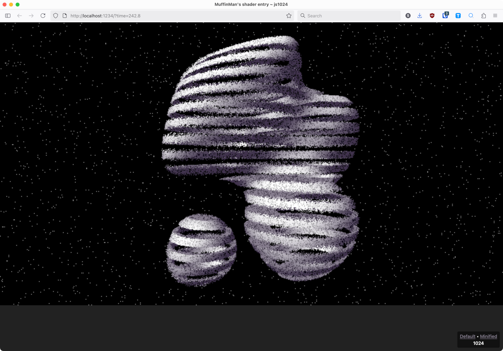

# js1024

My personal devtool for developing a shader for the [js1024](https://js1024.fun/) contest. It automatically refreshes when the shader file is updated and shows the sizes of the minified version.

You can use URL get param time to freeze the shader at specific frame (for example `?time=10.5`).



## System dependencies

- Bun - https://bun.sh/
- Mono - https://www.mono-project.com/ (in order to run the Shader Minifier)
- Shader Minifier - https://github.com/laurentlb/shader-minifier?tab=readme-ov-file (included in this repo)

## Dev

To install dependencies:

```bash
bun install
```

To run:

```bash
bun start
```

and open [http://localhost:1234](http://localhost:1234).

While server is running, it will watch `src/shader.frag` for changes, minify it and refresh the page.

## Build

```bash
bun run build
```

It will minify the shader and write it to `src/shader.min.frag`
